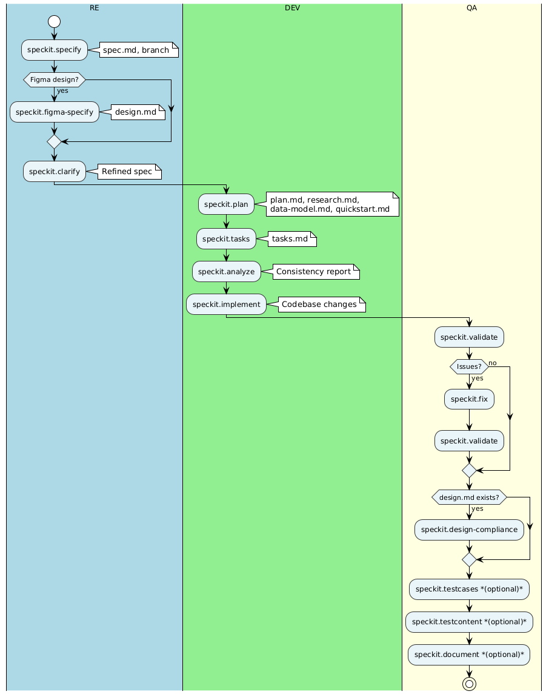
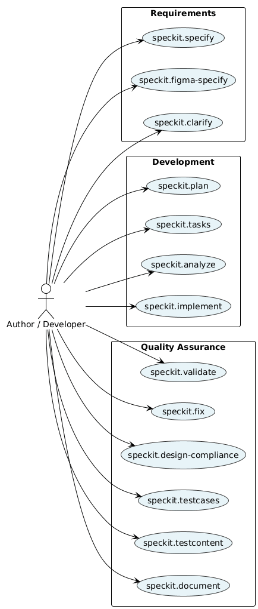
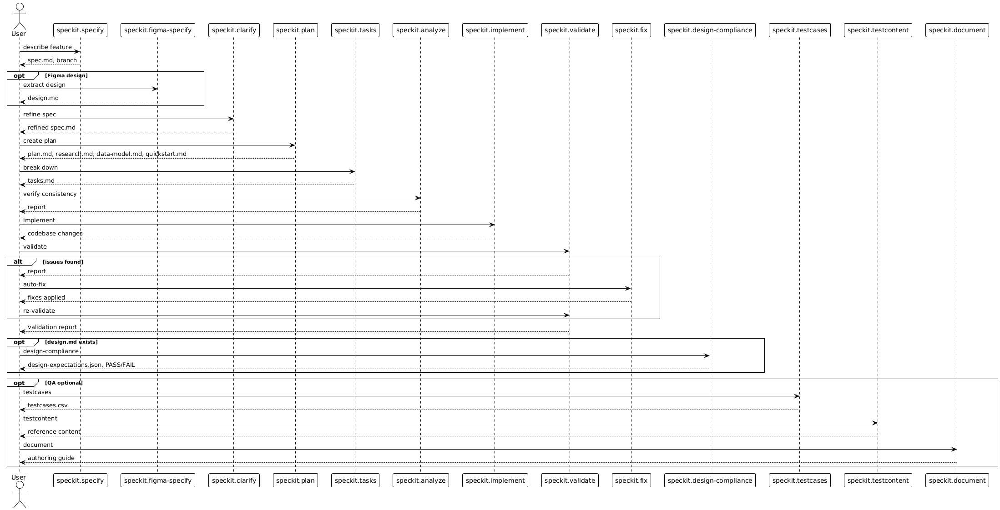
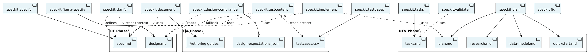
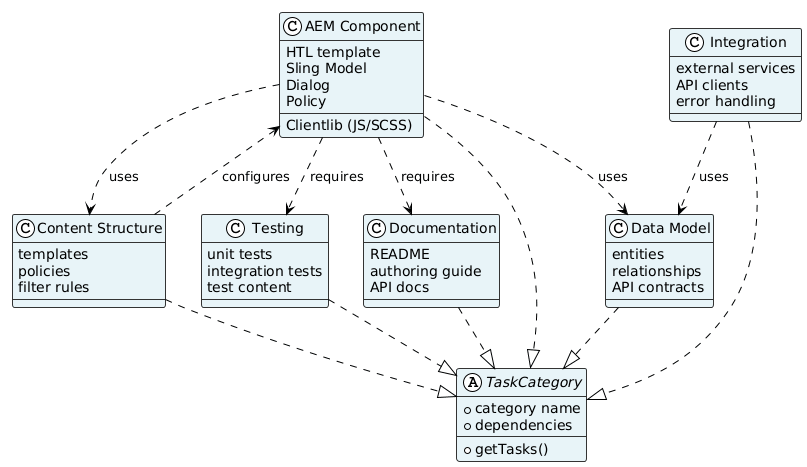

# Speckit Workflow — UML Diagrams

Specification-Driven Development (SDD) workflow for AEM Platform Core. Based on [GitHub Spec Kit](https://github.com/github/spec-kit), customized for AEM.

*Source: `.specify/docs/diagrams/*.puml`. To regenerate PNGs: run `./.specify/scripts/bash/regenerate-diagrams.sh` (uses [Kroki](https://kroki.io)), or use PlantUML locally with Graphviz.*

---

## 1. Activity Diagram (Main Workflow with Swimlanes)

UML Activity Diagram showing the end-to-end workflow with responsibilities per lane.

---

## 2. Use Case Diagram

UML Use Case Diagram: primary actor and speckit use cases.

---

## 3. Sequence Diagram (End-to-End)

UML Sequence Diagram for one complete speckit run.

---

## 4. Component Diagram (Artifact Dependencies)

UML Component Diagram showing artifacts produced by each command.

---

## 5. Class Diagram (Task Categories)

UML Class Diagram of implementation task categories and their dependencies.

---

## Quick Reference: Command Order

| Phase | Command | Output | Prerequisite | Next |
|-------|---------|--------|--------------|------|
| RE 1 | `/speckit.specify` | spec.md, branch, checklists/requirements-readiness-check.md | — | figma-specify, clarify, or plan |
| RE 2 | `/speckit.figma-specify` *(optional)* | design.md | spec.md | clarify or plan |
| RE 3 | `/speckit.clarify` | Refined spec (adds ## Clarifications) | spec.md; design.md if Figma used | plan |
| DEV 1 | `/speckit.plan` | plan.md, research.md, data-model.md, quickstart.md | spec.md | tasks |
| DEV 2 | `/speckit.tasks` | tasks.md | plan.md | analyze or implement |
| DEV 3 | `/speckit.analyze` *(optional)* | Consistency report (read-only) | tasks.md | implement |
| DEV 4 | `/speckit.implement` | Codebase changes | tasks.md, plan.md | validate |
| QA 1 | `/speckit.validate` | Validation report, VALIDATE-OUTPUT block (if issues) | Implementation complete | fix or design-compliance |
| QA 2 | `/speckit.fix` | Auto-fixes | VALIDATE-OUTPUT from validate | validate (re-run) |
| QA 3 | `/speckit.design-compliance` *(recommended if design.md)* | design-expectations.json, compliance result | design.md | testcontent or document |
| QA 4 | `/speckit.testcases` *(optional)* | testcases.csv | spec.md | testcontent |
| QA 5 | `/speckit.testcontent` *(optional)* | Reference content in digitalxn-aem-nc-sites-reference-content | testcases.csv or spec | document |
| QA 6 | `/speckit.document` *(optional)* | Authoring guide in .specify/memory/components/authoring-guides/ | Implementation complete | PR |

**RE order when Figma exists:** specify → figma-specify → clarify → plan. When no Figma: specify → clarify → plan.

**Other optional skills** (not in main flow): `/speckit.checklist` (generates domain checklists for spec quality).

---

## Prerequisites & Scripts

| Command | Setup Script |
|---------|--------------|
| clarify, plan, tasks, implement, validate, fix, design-compliance, testcases, testcontent, document | `check-prerequisites.sh --json [--require-tasks] [--include-tasks]` |
| specify | `create-new-feature.sh --json --number <n> --short-name "<name>" "<description>"` |
| plan | `setup-plan.sh --json` |

`check-prerequisites.sh` outputs: `FEATURE_DIR`, `FEATURE_SPEC`, `FEATURE_DESIGN`, `IMPL_PLAN`, `TASKS`, `AVAILABLE_DOCS`. Requires feature branch (e.g. `feature/001-name`).

---

## Artifact Paths

All spec artifacts live under `.specify/specs/<number>-<short-name>/`:

| Artifact | Path |
|----------|------|
| spec.md | `FEATURE_DIR/spec.md` |
| design.md | `FEATURE_DIR/design.md` |
| plan.md | `FEATURE_DIR/plan.md` |
| research.md | `FEATURE_DIR/research.md` |
| data-model.md | `FEATURE_DIR/data-model.md` |
| quickstart.md | `FEATURE_DIR/quickstart.md` |
| tasks.md | `FEATURE_DIR/tasks.md` |
| testcases.csv | `FEATURE_DIR/testcases.csv` |
| design-expectations.json | `FEATURE_DIR/design-expectations.json` |
| checklists/*.md | `FEATURE_DIR/checklists/` |

---

## Key Rules

- **spec.md** is the source of truth for functional requirements.
- **design.md** (from `/speckit.figma-specify`) is the source of truth for HTML/CSS when present. Plan, quickstart, and task summaries must not override it.
- **clarify** reads design.md when it exists as read-only context to refine spec; design.md is never modified.
- **design-compliance** requires design.md. Generates design-expectations.json and runs CSS compliance check.
- **testcases** can run after specify or clarify when spec is ready; also after implementation. Drives testcontent when present.
- **testcontent** best run after testcases; creates reference content in digitalxn-aem-nc-sites-reference-content.
- All paths under `.specify/specs/` (customization: not at repo root).
- One user story per feature (customization from ootb speckit).
