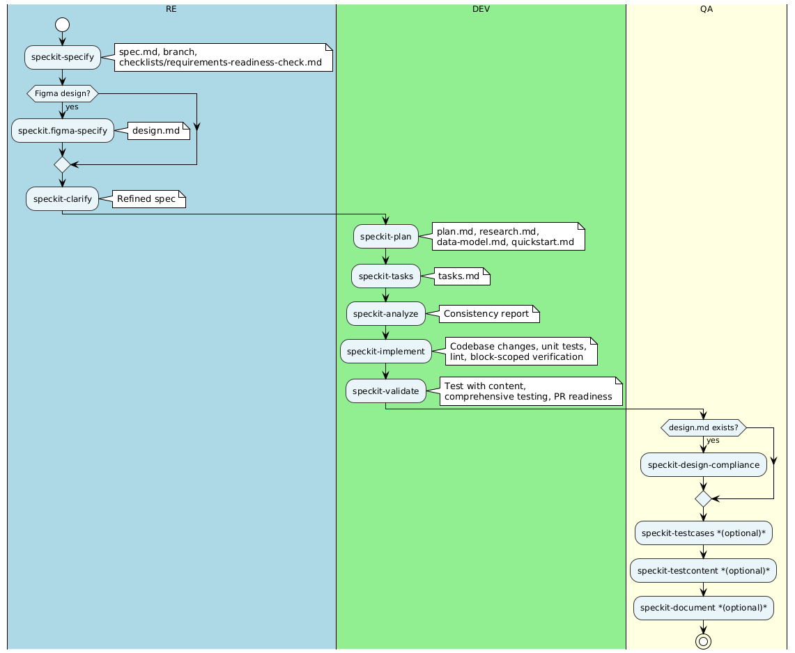
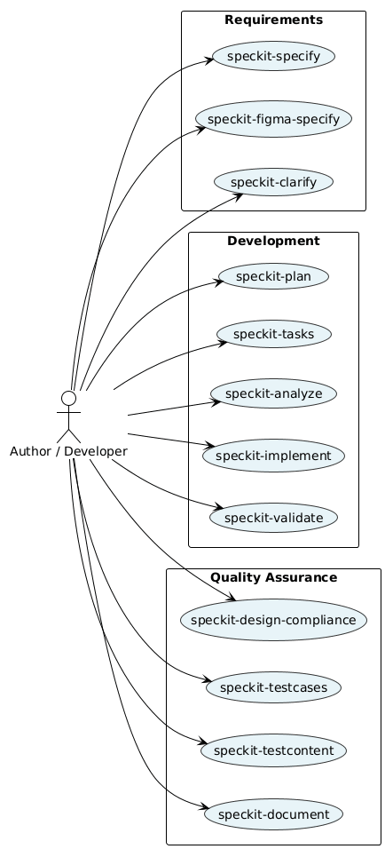
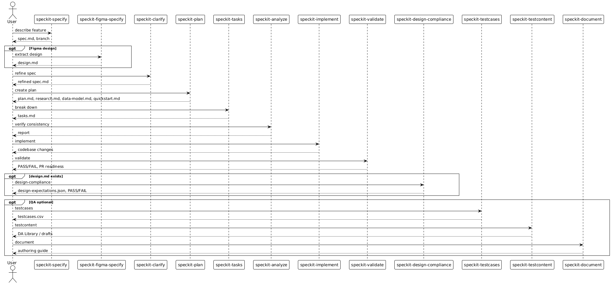
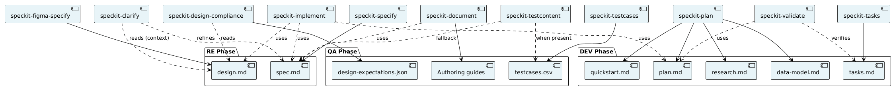
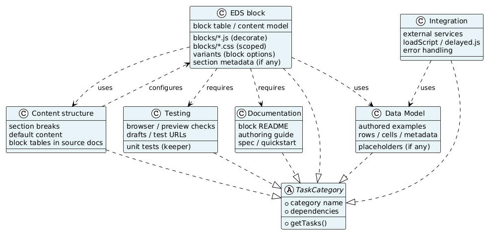

# Speckit workflow — UML diagrams

Specification-Driven Development (SDD) for **AEM Edge Delivery Services (EDS)** in this repo (GitHub code, `*.aem.page` / `*.aem.live`, vanilla `blocks/`). Based on [GitHub Spec Kit](https://github.com/github/spec-kit).

_Source: PlantUML in `.specify/docs/diagrams/*.puml`. Regenerate PNGs: `./.specify/scripts/bash/regenerate-diagrams.sh` ([Kroki](https://kroki.io)) or PlantUML + Graphviz locally. After editing `.puml` files, rerun the script so images match._

---

## 1. Activity diagram (main workflow with swimlanes)

End-to-end flow with responsibilities per lane.

---

## 2. Use case diagram

Primary actor and speckit use cases.

---

## 3. Sequence diagram (end-to-end)

One full speckit run.

---

## 4. Component diagram (artifact dependencies)

Artifacts produced by each command.

---

## 5. Class diagram (task categories)

Implementation task categories and dependencies (EDS-oriented in source; regenerate PNG after `.puml` changes).

---

## Quick reference: command order

Commands match the speckit-* skills under `.claude/skills/`. Your agent UI may show a different prefix (e.g. `/speckit-…`).

| Phase | Command | Output | Prerequisite | Next |
| ----- | ------- | ------ | ------------ | ---- |
| RE 1 | speckit-specify | spec.md, branch, `checklists/requirements-readiness-check.md` (if generated) | — | figma-specify, clarify, or plan |
| RE 2 | speckit-figma-specify _(optional)_ | design.md | spec.md | clarify or plan |
| RE 3 | speckit-clarify | Refined spec (e.g. ## Clarifications) | spec.md; design.md if Figma used | plan |
| DEV 1 | speckit-plan | plan.md, research.md, data-model.md, quickstart.md | spec.md | tasks |
| DEV 2 | speckit-tasks | tasks.md | plan.md | analyze or implement |
| DEV 3 | speckit-analyze _(optional)_ | Consistency report (read-only) | tasks.md | implement |
| DEV 4 | speckit-implement | Codebase changes; CDD Phase 3 (implement portion): unit tests, lint, block-scoped verification | tasks.md, plan.md | validate |
| DEV 5 | speckit-validate | CDD Phase 3 (validate portion): content testing, full checks, PR readiness (no file edits) | tasks.md, implementation | design-compliance or testcontent |
| DEV 6 | speckit-design-compliance _(if design.md)_ | design-expectations.json, compliance result | design.md | testcontent or document |
| QA 1 | speckit-testcases _(optional)_ | testcases.csv | spec.md | testcontent |
| QA 2 | speckit-testcontent _(optional)_ | DA Library upload and/or `drafts/*.plain.html` test pages (see speckit-testcontent skill) | testcases.csv or spec | document |
| QA 3 | speckit-document _(optional)_ | Authoring guide: prefer `blocks/{name}/README.md`; else `.specify/memory/components/authoring-guides/` | Implementation complete | PR |

**RE order when Figma exists:** specify → figma-specify → clarify → plan. When no Figma: specify → clarify → plan.

**Other optional:** speckit-checklist — requirements-quality checklists under `FEATURE_DIR/checklists/` (not implementation tests).

---

## Prerequisites & scripts

| Command | Setup script |
| ------- | ------------ |
| clarify, plan, tasks, implement, validate, design-compliance, testcases, testcontent, document | `check-prerequisites.sh --json [--require-tasks] [--include-tasks]` |
| specify | `create-new-feature.sh --json --number <n> --short-name "<name>" "<description>"` |
| plan | `setup-plan.sh --json` |

`check-prerequisites.sh` outputs: `FEATURE_DIR`, `FEATURE_SPEC`, `FEATURE_DESIGN`, `IMPL_PLAN`, `TASKS`, `AVAILABLE_DOCS`. Expect a feature branch (e.g. `f/001-name`).

---

## Artifact paths

All spec artifacts live under `.specify/specs/<number>-<short-name>/`:

| Artifact | Path |
| -------- | ---- |
| spec.md | `FEATURE_DIR/spec.md` |
| design.md | `FEATURE_DIR/design.md` |
| plan.md | `FEATURE_DIR/plan.md` |
| research.md | `FEATURE_DIR/research.md` |
| data-model.md | `FEATURE_DIR/data-model.md` |
| quickstart.md | `FEATURE_DIR/quickstart.md` |
| tasks.md | `FEATURE_DIR/tasks.md` |
| testcases.csv | `FEATURE_DIR/testcases.csv` |
| design-expectations.json | `FEATURE_DIR/design-expectations.json` |
| checklists/*.md | `FEATURE_DIR/checklists/` |

---

## Key rules

- **CDD Phase 3 split:** implement owns creation (unit tests, lint, block-scoped verification); validate owns verification (full project) and PR readiness (validate does not edit files).
- **spec.md** — functional requirements.
- **design.md** (from speckit-figma-specify) — HTML/block CSS/visual acceptance when present; plan, quickstart, tasks must not override it.
- **clarify** reads **design.md** read-only; does not modify design.md.
- **design-compliance** requires **design.md**; produces **design-expectations.json** and runs CSS compliance.
- **testcases** — author-facing EDS steps (preview/publish); can run after specify/clarify or later.
- **testcontent** — DA Library / **drafts/** per speckit-testcontent skill (not a separate “reference content” Java repo path).
- Artifacts under **`.specify/specs/`** (not at repo root).
- One main user story per feature (project convention).

See also **`.specify/README.md`** and **`AGENTS.md`**.
