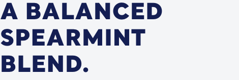

# Headline

**Atom**  ·  All heading levels (h1–h6). 145 bat-headline-default instances. Display font + ALL CAPS convention.

## Observed on the live site

- **Total instances:** 710
- **Page spread:** 8 pages (of 8 declared)
- **DOM fingerprint:** `bat-headline-default`, `.bat-headline-style`, `.bat-headline`

| Page | Count |
|------|-------|
| `what-is-zonnic` | 166 |
| `pouches-zonnic-mint-24-nicotine-pouches` | 134 |
| `why-zonnic` | 134 |
| `homepage` | 122 |
| `store-locator` | 60 |
| `testingblogarticletemplate` | 50 |
| `sign-up` | 24 |
| `contact-us-testimonials` | 20 |

## Variants

| Variant | Selector | Sample page | Evidence | Status |
|---------|----------|-------------|----------|--------|
| `h1-display` | `h1.bat-headline-style.headline1` | `homepage` |  | extracted |
| `h2-section` | `bat-headline-default h2, h2.bat-headline-style` | `homepage` |  | extracted |
| `h3-card` | `bat-headline-default h3, h3.bat-headline-style` | `homepage` | HTML only | HTML captured (hidden in modal) |

## EDS mapping

- **Strategy:** `default-content`
- **Notes:** Default content headings with :root type tokens.

## Files

- [`anatomy.html`](./anatomy.html) — outer HTML from live DOM (as-is, unnormalised).
- [`computed.css`](./computed.css) — `getComputedStyle` snapshot per variant.
- [`stats.json`](./stats.json) — page spread and occurrence counts.
- [`evidence/`](./evidence) — per-variant element screenshots.

## Source-of-truth note

This inventory is extracted **as observed** — not normalised. Colours,
spacing, weights, radii shown in `computed.css` reflect the live site.
Token consolidation happens in `migration-design-system`.