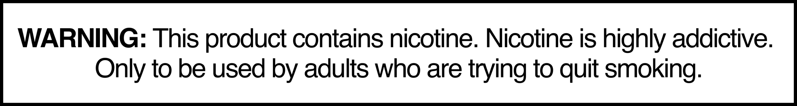

# Image

**Atom**  ·  Responsive picture wrapper. 191 bat-image-default + 238 .bat-image instances.

## Observed on the live site

- **Total instances:** 429
- **Page spread:** 8 pages (of 8 declared)
- **DOM fingerprint:** `bat-image-default`, `.bat-image`

| Page | Count |
|------|-------|
| `why-zonnic` | 127 |
| `what-is-zonnic` | 107 |
| `store-locator` | 84 |
| `pouches-zonnic-mint-24-nicotine-pouches` | 42 |
| `homepage` | 41 |
| `testingblogarticletemplate` | 14 |
| `contact-us-testimonials` | 7 |
| `sign-up` | 7 |

## Variants

| Variant | Selector | Sample page | Evidence | Status |
|---------|----------|-------------|----------|--------|
| `default` | `bat-image-default:not([hidden])` | `homepage` |  | extracted |

## EDS mapping

- **Strategy:** `default-content`
- **Notes:** EDS aem.live optimises images automatically — becomes auto-blocked <picture>.

## Files

- [`anatomy.html`](./anatomy.html) — outer HTML from live DOM (as-is, unnormalised).
- [`computed.css`](./computed.css) — `getComputedStyle` snapshot per variant.
- [`stats.json`](./stats.json) — page spread and occurrence counts.
- [`evidence/`](./evidence) — per-variant element screenshots.

## Source-of-truth note

This inventory is extracted **as observed** — not normalised. Colours,
spacing, weights, radii shown in `computed.css` reflect the live site.
Token consolidation happens in `migration-design-system`.