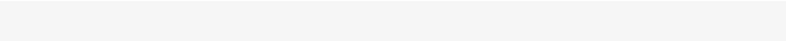
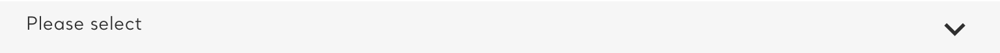

# Input

**Atom**  ·  Form input control (text, email, password, select, checkbox). 243 bat-form-field uses.

## Observed on the live site

- **Total instances:** 284
- **Page spread:** 8 pages (of 4 declared)
- **DOM fingerprint:** `.bat-form-field`, `.bat-form-field input`, `.bat-form-field select`

| Page | Count |
|------|-------|
| `sign-up` | 51 |
| `contact-us-testimonials` | 46 |
| `testingblogarticletemplate` | 32 |
| `homepage` | 31 |
| `pouches-zonnic-mint-24-nicotine-pouches` | 31 |
| `store-locator` | 31 |
| `what-is-zonnic` | 31 |
| `why-zonnic` | 31 |

## Variants

| Variant | Selector | Sample page | Evidence | Status |
|---------|----------|-------------|----------|--------|
| `text` | `.bat-form-field input[type='text'], .bat-form-field input[type='email']` | `sign-up` |  | extracted |
| `select` | `.bat-form-field select` | `sign-up` |  | extracted |
| `password` | `.bat-form-field input[type='password']` | `sign-up` |  | extracted |

## EDS mapping

- **Strategy:** `default-content`
- **Notes:** Form-block convention from Block Collection; custom styling via global CSS.

## Files

- [`anatomy.html`](./anatomy.html) — outer HTML from live DOM (as-is, unnormalised).
- [`computed.css`](./computed.css) — `getComputedStyle` snapshot per variant.
- [`stats.json`](./stats.json) — page spread and occurrence counts.
- [`evidence/`](./evidence) — per-variant element screenshots.

## Source-of-truth note

This inventory is extracted **as observed** — not normalised. Colours,
spacing, weights, radii shown in `computed.css` reflect the live site.
Token consolidation happens in `migration-design-system`.