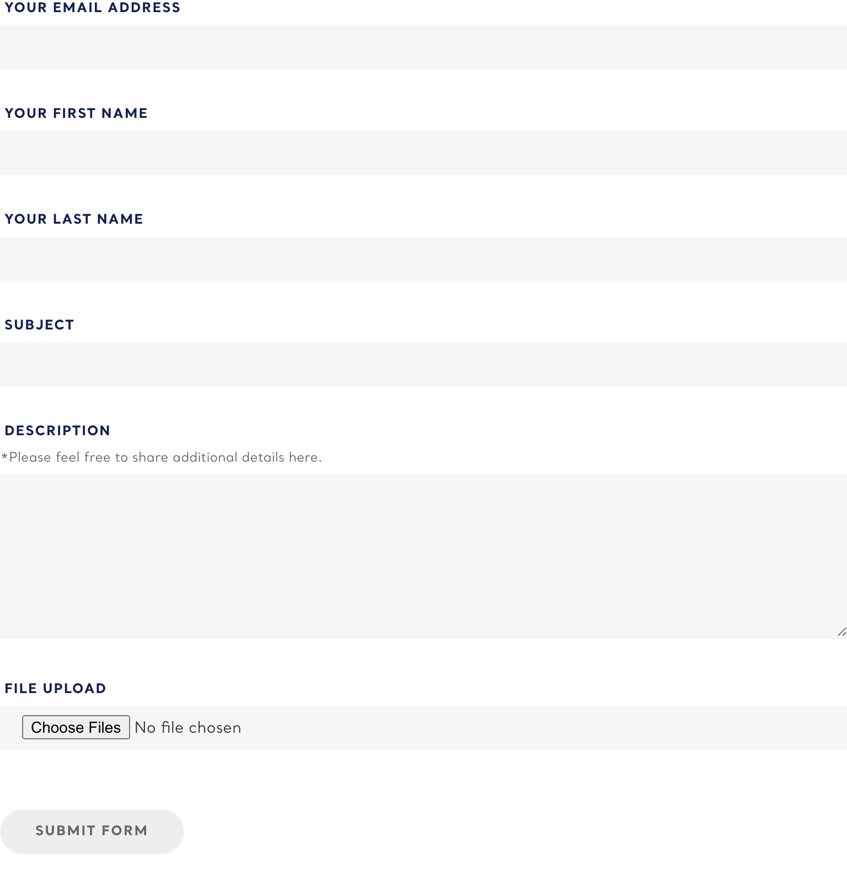

# Contact Form

**Organism**  ·  Contact-us / testimonials form. Delivered via the shared bat-form-signup web component with a contactUs field template (file upload + subject + description).

## Observed on the live site

- **Total instances:** 16
- **Page spread:** 1 pages (of 1 declared)
- **DOM fingerprint:** `.bat-form--contact-us-email`, `.bat-form--contact-us-email-first-name`

| Page | Count |
|------|-------|
| `contact-us-testimonials` | 16 |

## Variants

| Variant | Selector | Sample page | Evidence | Status |
|---------|----------|-------------|----------|--------|
| `default` | `bat-form-signup[data-template-url*='contactUs'], bat-form-signup:has(.bat-form--contact-us-email-first-name), form#step1Form` | `contact-us` |  | extracted |

## EDS mapping

- **Strategy:** `adapt-block:form`
- **Notes:** Block Collection `form` block; needs file-upload extension. Shares underlying component with signup-form.

## Files

- [`anatomy.html`](./anatomy.html) — outer HTML from live DOM (as-is, unnormalised).
- [`computed.css`](./computed.css) — `getComputedStyle` snapshot per variant.
- [`stats.json`](./stats.json) — page spread and occurrence counts.
- [`evidence/`](./evidence) — per-variant element screenshots.

## Source-of-truth note

This inventory is extracted **as observed** — not normalised. Colours,
spacing, weights, radii shown in `computed.css` reflect the live site.
Token consolidation happens in `migration-design-system`.