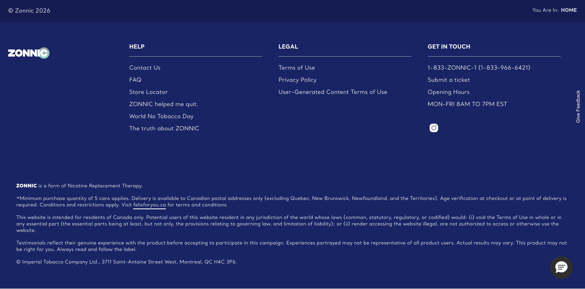

# Footer

**Organism**  ·  ⚠️ Regulatory  ·  Meta strip + 4-column link groups + regulatory health-warning band. 8/8 pages.

## Observed on the live site

- **Total instances:** 208
- **Page spread:** 8 pages (of 8 declared)
- **DOM fingerprint:** `bat-footer-zonnic`, `.bat-footer-zonnic`

| Page | Count |
|------|-------|
| `contact-us-testimonials` | 26 |
| `homepage` | 26 |
| `pouches-zonnic-mint-24-nicotine-pouches` | 26 |
| `sign-up` | 26 |
| `store-locator` | 26 |
| `testingblogarticletemplate` | 26 |
| `what-is-zonnic` | 26 |
| `why-zonnic` | 26 |

## Variants

| Variant | Selector | Sample page | Evidence | Status |
|---------|----------|-------------|----------|--------|
| `default` | `bat-footer-zonnic` | `homepage` |  | extracted |

## EDS mapping

- **Strategy:** `adapt-block:footer`
- **Notes:** Reuse Block Collection footer; add newsletter signup row + regulatory band.

## Files

- [`anatomy.html`](./anatomy.html) — outer HTML from live DOM (as-is, unnormalised).
- [`computed.css`](./computed.css) — `getComputedStyle` snapshot per variant.
- [`stats.json`](./stats.json) — page spread and occurrence counts.
- [`evidence/`](./evidence) — per-variant element screenshots.

## Source-of-truth note

This inventory is extracted **as observed** — not normalised. Colours,
spacing, weights, radii shown in `computed.css` reflect the live site.
Token consolidation happens in `migration-design-system`.