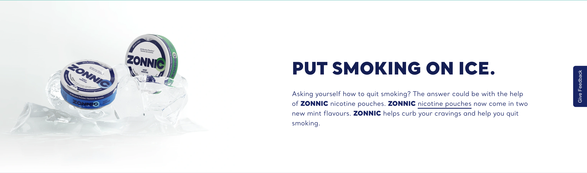

# Hero

**Organism**  ·  Full-bleed masthead: headline + sub-copy + CTA list + background image. 14 instances on 4 pages.

## Observed on the live site

- **Total instances:** 82
- **Page spread:** 4 pages (of 4 declared)
- **DOM fingerprint:** `bat-hero-zonnic`, `.bat-hero-zonnic`

| Page | Count |
|------|-------|
| `homepage` | 38 |
| `what-is-zonnic` | 22 |
| `why-zonnic` | 12 |
| `pouches-zonnic-mint-24-nicotine-pouches` | 10 |

## Variants

| Variant | Selector | Sample page | Evidence | Status |
|---------|----------|-------------|----------|--------|
| `default` | `bat-hero-zonnic` | `why-zonnic` |  | extracted |

## EDS mapping

- **Strategy:** `adapt-block:hero`
- **Notes:** Block Collection hero adapted with responsive variant + on-dark CTA pattern.

## Files

- [`anatomy.html`](./anatomy.html) — outer HTML from live DOM (as-is, unnormalised).
- [`computed.css`](./computed.css) — `getComputedStyle` snapshot per variant.
- [`stats.json`](./stats.json) — page spread and occurrence counts.
- [`evidence/`](./evidence) — per-variant element screenshots.

## Source-of-truth note

This inventory is extracted **as observed** — not normalised. Colours,
spacing, weights, radii shown in `computed.css` reflect the live site.
Token consolidation happens in `migration-design-system`.