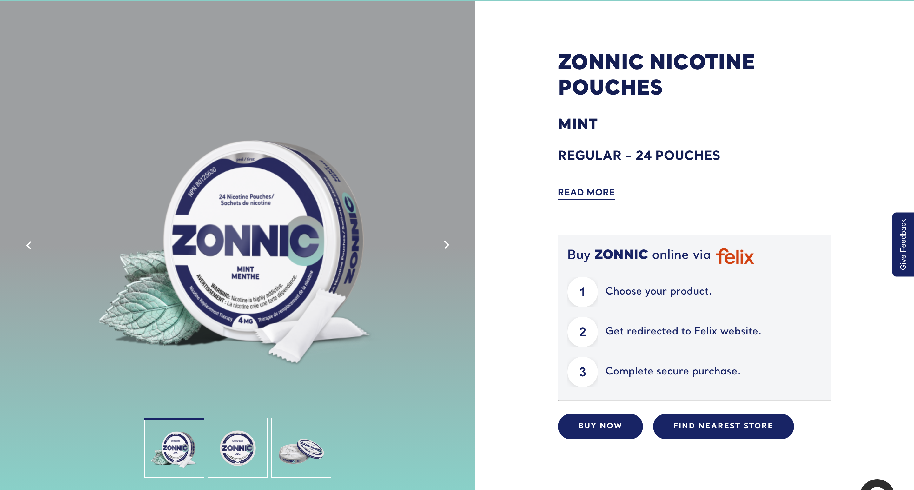

# Product Hero

**Organism**  ·  PDP hero: image gallery + buy-now panel + product metadata.

## Observed on the live site

- **Total instances:** 1
- **Page spread:** 1 pages (of 1 declared)
- **DOM fingerprint:** `bat-producthero-zonnic`, `.bat-producthero-zonnic`

| Page | Count |
|------|-------|
| `pouches-zonnic-mint-24-nicotine-pouches` | 1 |

## Variants

| Variant | Selector | Sample page | Evidence | Status |
|---------|----------|-------------|----------|--------|
| `default` | `bat-producthero-zonnic` | `product-detail` |  | extracted |

## EDS mapping

- **Strategy:** `new-block:product-hero`
- **Notes:** Integrates PriceSpider buy-now widget; auto-blocked from PDP metadata + featured-image.

## Files

- [`anatomy.html`](./anatomy.html) — outer HTML from live DOM (as-is, unnormalised).
- [`computed.css`](./computed.css) — `getComputedStyle` snapshot per variant.
- [`stats.json`](./stats.json) — page spread and occurrence counts.
- [`evidence/`](./evidence) — per-variant element screenshots.

## Source-of-truth note

This inventory is extracted **as observed** — not normalised. Colours,
spacing, weights, radii shown in `computed.css` reflect the live site.
Token consolidation happens in `migration-design-system`.