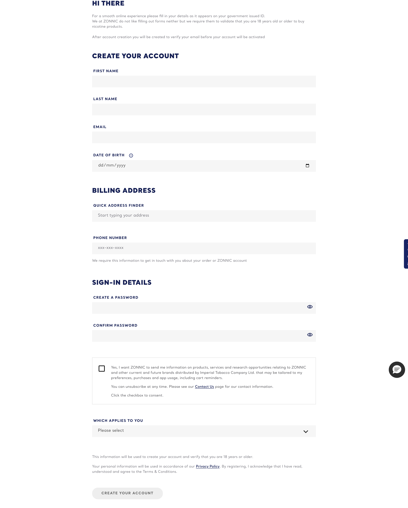

# Signup Form

**Organism**  ·  Multi-step sign-up form: account + personal + subscription. 16 uses on 7 pages (embedded everywhere).

## Observed on the live site

- **Total instances:** 184
- **Page spread:** 7 pages (of 4 declared)
- **DOM fingerprint:** `bat-form-signup`, `.bat-form--signup`

| Page | Count |
|------|-------|
| `sign-up` | 46 |
| `contact-us-testimonials` | 23 |
| `homepage` | 23 |
| `pouches-zonnic-mint-24-nicotine-pouches` | 23 |
| `store-locator` | 23 |
| `what-is-zonnic` | 23 |
| `why-zonnic` | 23 |

## Variants

| Variant | Selector | Sample page | Evidence | Status |
|---------|----------|-------------|----------|--------|
| `default` | `bat-form-signup` | `sign-up` |  | extracted |

## EDS mapping

- **Strategy:** `new-block:signup-form`
- **Notes:** Large new block with multi-step logic; integrates Loqate for address validation + Salesforce write-back.

## Files

- [`anatomy.html`](./anatomy.html) — outer HTML from live DOM (as-is, unnormalised).
- [`computed.css`](./computed.css) — `getComputedStyle` snapshot per variant.
- [`stats.json`](./stats.json) — page spread and occurrence counts.
- [`evidence/`](./evidence) — per-variant element screenshots.

## Source-of-truth note

This inventory is extracted **as observed** — not normalised. Colours,
spacing, weights, radii shown in `computed.css` reflect the live site.
Token consolidation happens in `migration-design-system`.